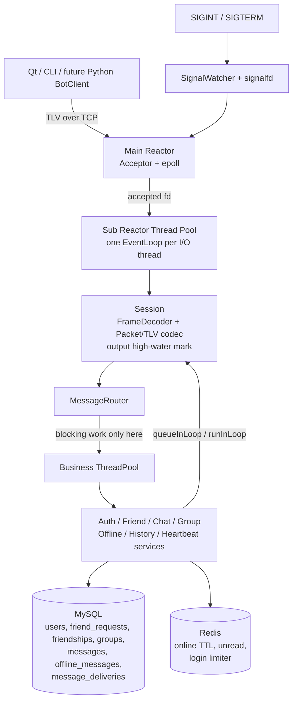
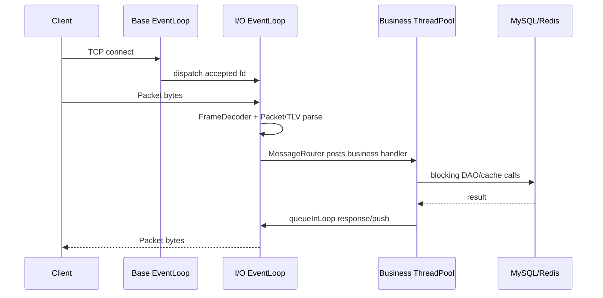
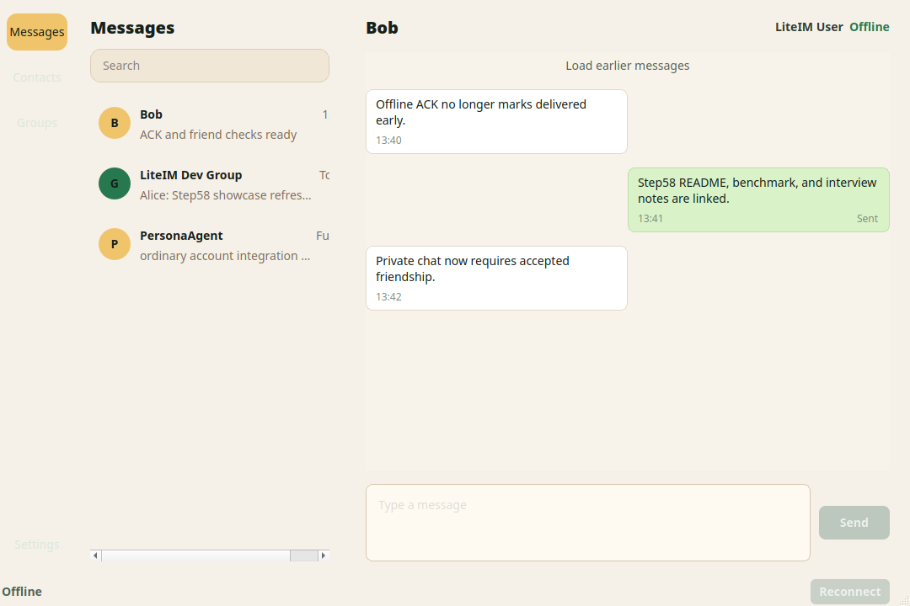

# LiteIM


LiteIM is a C++17 instant messaging server project built around Linux networking and a one-loop-per-thread Reactor model. The project is developed step by step so each layer remains understandable: protocol encoding, TCP stream decoding, nonblocking I/O, connection lifetime, multi-Reactor dispatch, business-thread isolation, timer-driven heartbeat cleanup, and later MySQL / Redis backed IM services.

The long-term target is a small but realistic IM system:

```text
Qt / CLI client
future PersonaAgent Python BotClient
    -> same TLV account protocol
    -> LiteIM C++ TCP Server
    -> business ThreadPool
    -> MySQL / Redis
```

PersonaAgent is intentionally a separate Python service. LiteIM exposes only the normal account protocol boundary; Python, LangGraph, RAG, LLM calls, and safety logic do not run inside the C++ server process, and the C++ server does not know whether a logged-in account is controlled by a human or by an external agent.

## Project Focus

- High-performance C++ backend engineering with C++17, CMake, RAII, GoogleTest, and Linux system calls.
- Nonblocking socket I/O with `epoll` LT mode, `eventfd` cross-thread wakeups, `timerfd` based timers, and `signalfd` graceful shutdown handling.
- Main Reactor + sub Reactor thread pool. I/O threads handle fd events, Packet/TLV codec work, configurable output-buffer high-water-mark backpressure, and `Session` lifetime.
- Bounded business `ThreadPool` for dispatching heavier protocol handlers such as MySQL queries, Redis operations, password hashing, and history loading without unbounded task buildup.
- MySQL C API wrapper with RAII connection ownership, prepared statements, a fixed-size connection pool, and users-table DAO access.
- Custom TLV binary protocol with TCP sticky-packet / half-packet handling.
- Safe cross-thread connection access through `EventLoop::runInLoop()` and `EventLoop::queueInLoop()`.
- Command-line protocol debug client, Python E2E tests, local benchmark tooling, and optional Qt Widgets three-column chat client.

## Technology Stack

| Layer | Stack |
| --- | --- |
| Language and build | C++17, CMake, GoogleTest, gMock, CTest |
| Linux network core | nonblocking socket, `epoll` LT, `eventfd`, `timerfd`, `signalfd`, one-loop-per-thread Reactor |
| Concurrency | main Reactor, sub Reactor thread pool, business `ThreadPool`, `runInLoop()` / `queueInLoop()` owner-loop handoff |
| Protocol | custom binary Packet header + TLV body, TCP half-packet and sticky-packet decoding |
| Storage | MySQL 8.0, MySQL C API, RAII connection guard, prepared statement wrapper, DAO layer |
| Cache/state | Redis 7.2, hiredis, online TTL, unread counters, login failure limiter |
| Clients and tooling | Qt Widgets demo client, CLI protocol client, Python black-box E2E client, benchmark executable |
| Quality gates | unit/integration/e2e/docker CTest labels, ASan/UBSan option, GitHub Actions CI |

## Architecture

### Server Architecture Diagram



```text
                         +----------------------+
                         | Qt / CLI / future BotClient |
                         +----------+-----------+
                                    |
                              TLV over TCP
                                    |
+------------------------------- LiteIM Server -------------------------------+
|                                                                            |
|  Main Reactor                                                               |
|  - nonblocking listen socket                                                |
|  - epoll accept events                                                      |
|  - dispatch accepted connections                                            |
|  - signalfd driven SIGINT / SIGTERM shutdown                                |
|                                                                            |
|  Sub Reactor Thread Pool                                                    |
|  - one EventLoop per I/O thread                                             |
|  - eventfd queueInLoop wakeup                                               |
|  - Session read/write lifecycle                                             |
|  - FrameDecoder + Packet/TLV codec                                          |
|  - configurable output-buffer high-water-mark protection                    |
|                                                                            |
|  Business Thread Pool                                                       |
|  - AuthService / FriendService / ChatService / OfflineMessageService        |
|  - GroupService / HistoryService / HeartbeatService                         |
|  - MySQL DAO and Redis cache operations                                     |
|  - post responses back to the owning EventLoop                              |
|                                                                            |
+---------------------------+----------------------+-------------------------+
                            |                      |
                         MySQL                  Redis
                   persistent entities      online/unread/rate-limit
```

Important boundaries:

- I/O threads must not execute MySQL or Redis blocking calls.
- Business threads must not directly mutate `Session`.
- Responses generated outside the owning I/O thread must be delivered through the owning `EventLoop`.
- `Session` lifetime is protected with `shared_ptr` / `weak_ptr`, not long-lived raw pointers.
- Reactor-owned objects such as `Acceptor`, `TcpServer`, `TimerManager`, and `SignalWatcher` must stop and destruct in their owner loop thread.
- Redis is cache/state, not the final source of message truth. Message entities belong in MySQL.

### Threading Model Diagram



Threading rules:

- Main Reactor accepts new connections and owns `TcpServer` / `Acceptor`.
- Each sub Reactor owns its `Session` objects and all direct socket I/O.
- Business threads may query MySQL / Redis and build response packets.
- Business threads never directly mutate `Session`; they hand work back to the owning I/O loop.
- `eventfd` wakes an `EventLoop` when another thread queues work to it.
- `timerfd` drives fixed-tick heartbeat cleanup.
- `signalfd` converts SIGINT / SIGTERM into ordinary fd events for graceful shutdown.

## Core Components

- `liteim_base`: `Config`, `Logger`, `ErrorCode`, `Status`, `Timestamp`, and raw-byte aliases `Byte` / `Bytes`.
- `liteim_protocol`: `MessageType`, `TlvType`, `ByteOrder`, `Packet`, `TlvCodec`, and `FrameDecoder`.
- `liteim_net`: `Buffer`, `SocketUtil`, `UniqueFd`, `Channel`, `Epoller`, `EventLoop`, `Acceptor`, `Session`, `EventLoopThread`, `EventLoopThreadPool`, `SignalWatcher`, and `TcpServer`.
- `liteim_concurrency`: fixed-size business `ThreadPool` with an optional pending-task queue limit.
- `liteim/timer`: `TimerHeap` and `TimerManager`, linked into the network layer because `TimerManager` depends on `EventLoop` and `Channel`.
- `liteim_storage`: storage DTOs, the `IStorage` interface, `MySqlConnection`, `PreparedStatement`, `MySqlQueryResult`, `MySqlPool`, `ConnectionGuard`, `UserDao`, `AuthDao`, `MessageDao`, `OfflineMessageDao`, `FriendDao`, `GroupDao`, and `MySqlStorage` for MySQL-backed users, friend requests, accepted friend profiles, groups, messages, offline messages, delivery states, and history.
- `liteim_cache`: cache DTOs, the `ICache` interface, `RedisClient`, `RedisPool`, `RedisConnectionGuard`, `OnlineStatusCache`, `UnreadCounter`, `LoginRateLimiter`, and `RedisCache` for Redis-backed online sessions, unread counters, and login failure limiting.
- `liteim_service`: `SessionManager`, `OnlineService`, `MessageRouter`, `AuthService`, `FriendService`, `ChatService`, `GroupService`, `OfflineMessageService`, `HistoryService`, `HeartbeatService`, and shared service helpers for validation and message TLV response building. `SessionManager` / `OnlineService` provide in-process user/session binding plus Redis-backed online-state synchronization, and runtime session close cleanup removes current online state through the business pool. `MessageRouter` parses request TLVs, dispatches handlers inline or through the business `ThreadPool`, sends responses back through `Session::sendPacket()`, and turns business-pool submit failures such as `ResourceExhausted` into `ErrorResponse` instead of running blocking work in an I/O thread. `AuthService` handles register/login/logout with MySQL users, Redis login-failure limiting keyed by username plus real `Session::peerIp()`, PBKDF2-HMAC-SHA256 password hashing, login-time session binding, logout-time session unbinding, and service-level username/nickname/password length validation before database access. `FriendService` handles `AddFriendRequest` as a pending friend request, accepts/rejects requests through `AcceptFriendRequest` / `RejectFriendRequest`, lists only accepted friendships, and degrades Redis online-status lookup failure to offline instead of failing the whole list. `ChatService` handles private-message requests by validating the logged-in sender, requiring the receiver to be an accepted friend, enforcing the service message-size limit, accepting an optional `ClientMessageId` idempotency key, saving the message through `IStorage`, pushing to an in-process online receiver, or recording offline delivery plus unread count for an offline receiver. Duplicate `(sender_id, client_msg_id)` private-message retries reuse the already stored `message_id` and do not repeat push/offline/unread side effects. `ChatService` also handles receiver-side `DeliveryAckRequest` for private-message pushes: it verifies the current user is the message receiver and records `message_deliveries.status = delivered`; `PrivateMessageResponse` remains only the sender-side server-stored ACK. `GroupService` handles basic create/join/list group flows and group-message routing, validates group-name/message-text lengths, saves group messages through `IStorage`, pushes to in-process online members, and records offline delivery plus unread counts for offline members. If the message and offline row are already saved, Redis unread increment failure is logged but does not turn the sender response into a failure. `OfflineMessageService` handles client-triggered `OfflineMessagesRequest` and `OfflineMessagesAckRequest`: pull returns pending offline messages without marking them delivered, while ACK marks the selected message ids delivered in MySQL, updates `message_deliveries`, and clears Redis unread counters as a best-effort post-ACK side effect. `HistoryService` handles `HistoryRequest`, validates that the logged-in user can read the private or group conversation, applies default/max cursor pagination limits, and returns repeated TLV message fields from `IStorage::getHistory()`. `HeartbeatService` handles `HeartbeatRequest` in the business pool, returns `HeartbeatResponse` for valid heartbeats, and refreshes Redis online TTL only for logged-in sessions. LiteIM has no C++ AI/assistant identity service: an external LLM-controlled account logs in and sends messages exactly like any other account. Redis TTL/unread refresh failures are logged as degraded side effects when the message source of truth is already saved. Repeated login uses a kick-old-keep-new policy.
- `liteim_client_cli`: command parsing, TLV `Packet` construction, debug packet formatting, and a blocking TCP protocol client used by the `liteim_cli` executable.
- `liteim_bench_core` / `liteim_bench`: local benchmark helpers and executable for generating ordinary register/login/private-message load, sender request/response RTT percentiles, QPS, error count, client-process RSS, client-process CPU usage, and JSON or Markdown reports.
- `liteim_qt_client_core` / `liteim_qt_client`: optional Qt Widgets client components built only with `LITEIM_BUILD_QT_CLIENT=ON`. The core target wraps the shared LiteIM Packet/TLV protocol for Qt, decodes TCP half/sticky packets, provides a `QTcpSocket` based `TcpClient`, keeps client-side seq_id, pending-request, login state, connection endpoint, heartbeat timer, connection status, and one-shot auto reconnect in `ClientSession` / `ClientRuntime`, exposes `AuthController`, `LoginWindow`, and `RegisterDialog` for login/register entry flow, and builds the `MainWindow` three-column shell with `SideBar`, model-driven `ConversationListWidget`, reusable `ContactListWidget`, and a right-side `ChatPage`. The Qt chat page has reusable `MessageBubble` rows, a `ChatInputBar`, left/right bubble layout, timestamp and send-status labels, Enter-to-send / Shift+Enter-newline behavior, history pagination keyed by `message_id`, and failed-send status text. `ChatController` connects the selected friend/group/ordinary PersonaAgent contact to `HistoryRequest`, `PrivateMessageRequest`, `GroupMessageRequest`, add-friend, create-group, and join-group packets over the same normal account protocol.

## Protocol And Data Model

### TLV Protocol Summary

LiteIM uses a binary Packet header plus a TLV body. TCP is a byte stream, so `FrameDecoder` first reconstructs full packets from arbitrary chunks, then the service layer parses TLV fields.

Packet header:

| Field | Size | Meaning |
| --- | ---: | --- |
| `magic` | 4 bytes | fixed `0x4C494D31`, ASCII `LIM1` |
| `version` | 1 byte | current protocol version, `1` |
| `flags` | 1 byte | current value `0` |
| `msg_type` | 2 bytes | `MessageType`, such as `LoginRequest` or `PrivateMessagePush` |
| `seq_id` | 8 bytes | client-generated request id; response keeps the same id |
| `body_len` | 4 bytes | TLV body length, capped by `kMaxPacketBodyLength` |

TLV body:

| Field | Size | Meaning |
| --- | ---: | --- |
| `type` | 2 bytes | `TlvType`, such as `Username`, `UserId`, `MessageText`, `ClientMessageId` |
| `len` | 4 bytes | value length |
| `value` | `len` bytes | UTF-8 string bytes or big-endian unsigned integer bytes |

Main message families:

| Range | Message types |
| --- | --- |
| Heartbeat | `HeartbeatRequest` / `HeartbeatResponse` |
| Auth | `RegisterRequest`, `LoginRequest`, `LogoutRequest`, and responses |
| Friend | `AddFriendRequest`, `AcceptFriendRequest`, `RejectFriendRequest`, `ListFriendsRequest`, and responses |
| Private chat | `PrivateMessageRequest`, `PrivateMessageResponse`, `PrivateMessagePush`, `DeliveryAckRequest`, and `DeliveryAckResponse` |
| Group chat | create, join, list, message request/response/push |
| Offline/history | `OfflineMessagesRequest`, `OfflineMessagesAckRequest`, `HistoryRequest`, and responses |
| Error | `ErrorResponse` with an error message TLV |

Private-message retry idempotency is optional and backward compatible. A newer client may include `ClientMessageId` in `PrivateMessageRequest`; LiteIM stores it as `messages.client_msg_id` and enforces uniqueness on `(sender_id, client_msg_id)`. If the same sender retries the same id after a network timeout, the server returns the existing stored message fields instead of inserting or delivering the message twice. Older clients that do not send `ClientMessageId` keep the original non-idempotent send behavior.

Private chat requires an accepted friendship. `AddFriendRequest(target_user_id=1002)` creates a pending row in `friend_requests`; Bob must send `AcceptFriendRequest(target_user_id=1001)` before Alice can send Bob a private message. `RejectFriendRequest` records the request as rejected and does not create friendship rows.

Private-message delivery ACK is receiver-side. After Bob's client receives `PrivateMessagePush(message_id=5001)`, it may send `DeliveryAckRequest(message_id=5001)`. The server verifies Bob is the receiver and records `message_deliveries.status = delivered`, then returns `DeliveryAckResponse` with `DeliveryStatus = 2`. This is separate from `PrivateMessageResponse`, which only means the server stored or reused the message for Alice.

### Delivery Semantics

LiteIM now separates three message states that are often confused in IM interviews:

| State | Meaning | Current LiteIM support |
| --- | --- | --- |
| `server-stored` | The server has accepted and persisted the sender's message. | `PrivateMessageResponse` / `GroupMessageResponse` mean this level only. For private chat, optional `ClientMessageId` makes sender retries idempotent. |
| `delivered` | The receiver's client has acknowledged receiving a pushed or offline message. | Private online push uses `DeliveryAckRequest`; offline pull uses `OfflineMessagesAckRequest`. Both update MySQL delivery state after client ACK, not when the server merely queues bytes to a socket. |
| `read` | The user has opened or read the message. | Reserved in `message_deliveries`, but no read-receipt protocol is implemented yet. README and interview wording should not claim read receipts. |

TCP ACK is not counted as delivered in this README. It only confirms bytes at the transport layer and does not prove that the application decoded, stored, or displayed the message.

### MySQL Table Summary

| Table | Responsibility |
| --- | --- |
| `users` | account id, username, password hash/salt, nickname, created/updated timestamps |
| `friend_requests` | pending/accepted/rejected friend request state keyed by `(requester_id, target_user_id)` |
| `friendships` | bidirectional friend relation rows keyed by `(user_id, friend_id)` |
| `chat_groups` | group id, owner id, group name, created/updated timestamps |
| `group_members` | group membership keyed by `(group_id, user_id)` |
| `messages` | private/group message source of truth, indexed by `(conversation_type, conversation_id, message_id)` and protected by optional `(sender_id, client_msg_id)` idempotency |
| `offline_messages` | per-user pending offline delivery rows linked to `messages` |
| `message_deliveries` | per-user delivery state linked to `messages`; current states are pending, pushed, delivered, and read-reserved |

### Redis Key Summary

| Key pattern | Purpose |
| --- | --- |
| `online:user:<user_id>` | serialized online session with TTL; heartbeat refreshes TTL for logged-in sessions |
| `unread:user:<user_id>:conversation:<type>:<conversation_id>` | per-user unread count for private or group conversation |
| `login:failure:<username_len>:<username>:<ip_len>:<remote_ip>` | temporary login failure count used by the login rate limiter |

Redis stores volatile state only. MySQL remains the source of truth for users, friend requests, accepted friendships, groups, messages, offline-message rows, and delivery states.

## Qt Client Showcase

The optional Qt client is a demo layer over the same TLV account protocol. It uses Qt Widgets, `QTcpSocket`, signal/slot wiring, a login/register flow, a familiar three-column IM layout, message bubbles, conversation/contact/group lists, a normal PersonaAgent contact row, heartbeat state, and reconnect feedback. It does not embed an AI runtime and does not use WeChat branding, logos, screenshots, or assets.

Generated local showcase screenshot:



Regenerate the screenshot from the real Qt Widgets code path when needed:

```bash
cmake -S . -B build-qt -DLITEIM_BUILD_QT_CLIENT=ON
cmake --build build-qt --target liteim_qt_client

# Manual demo screenshot:
docker compose -f docker/docker-compose.yml up -d --wait
./build/server/liteim_server
./build-qt/client_qt/liteim_qt_client
```

For CI or headless checks, use `QT_QPA_PLATFORM=offscreen` only as a startup/render smoke check. A visual demo screenshot should be captured from a real desktop session or from a deliberate render helper.

## Build And Test

Requirements:

- Linux
- CMake
- A C++17 compiler
- Python 3 for end-to-end protocol tests
- POSIX sockets, `epoll`, `eventfd`, `timerfd`, and `signalfd`
- `pkg-config`, MySQL client development files that provide `mysqlclient`, hiredis development files that provide `hiredis`, and OpenSSL development files that provide `openssl`

Build:

```bash
cmake -S . -B build
cmake --build build
```

Build the optional Qt Widgets client only when Qt development packages are available:

```bash
cmake -S . -B build-qt -DLITEIM_BUILD_QT_CLIENT=ON
cmake --build build-qt --target liteim_qt_client
```

Run the Qt client protocol tests from the Qt-enabled build:

```bash
ctest --test-dir build-qt -R "LiteIMQtClient.Step46|LiteIMQtClient.Step47|LiteIMQtClient.Step48|LiteIMQtClient.Step49|LiteIMQtClient.Step50|LiteIMQtClient.Step51|LiteIMQtClient.Step52|LiteIMCMake.QtClientFoundation" --output-on-failure
```

The default build keeps `LITEIM_BUILD_QT_CLIENT=OFF`, so server, CLI, benchmark, and tests do not require Qt. The current local Qt package is discovered from Anaconda Qt5; the Qt CTest entry sets `LD_LIBRARY_PATH` so the system `libstdc++` stays ahead of Anaconda's older `libstdc++`.

Run the server executable:

```bash
./build/server/liteim_server
# or explicitly choose a config file
./build/server/liteim_server --config config/liteim.conf
```

Without `--config`, the server first tries `config/liteim.conf` if it exists and otherwise falls back to built-in local-development defaults. The server starts a real `EventLoop + TcpServer` on the configured host and port, starts MySQL / Redis pools, starts the bounded business `ThreadPool`, and wires incoming packets into `MessageRouter`. Heartbeat requests are handled by `HeartbeatService`; register/login/logout requests by `AuthService`; friend request, accept/reject, and friend-list requests by `FriendService`; private-message requests by `ChatService`; group create/join/list/message requests by `GroupService`; offline-message pull and ACK requests by `OfflineMessageService`; history requests by `HistoryService`; and unknown or unsupported request types get `ErrorResponse`. LiteIM treats every logged-in account as an ordinary account, so a future PersonaAgent-controlled account is just another client session. Business handlers run in the business pool. If the business pending queue is full, `MessageRouter` returns `ErrorResponse(ResourceExhausted)` instead of executing blocking work in an I/O callback. Session close cleanup submits `OnlineService::unbindSession(session_id)` into the business pool so Redis online-state cleanup does not run in an I/O callback. The server handles `Ctrl-C` / `SIGTERM` through `signalfd`, stops `TcpServer` in the base loop thread, stops the business pool, closes MySQL / Redis pools, and exits cleanly.

Because the current server runtime starts real MySQL / Redis pools, start local dependencies before a bounded server smoke check:

```bash
docker compose -f docker/docker-compose.yml up -d --wait
timeout 1s ./build/server/liteim_server || test $? -eq 124
```

Run the command-line protocol client:

```bash
./build/client_cli/liteim_cli --host 127.0.0.1 --port 9000
```

Useful CLI commands:

```text
register cli_alice secret CLI Alice
login cli_alice secret
logout
add-friend 1002
# after another user sends you a request:
accept-friend 1001
reject-friend 1001
friends
private 1002 hello bob
private-id 1002 cli-msg-1 hello bob
create-group project room
join-group 2001
groups
group 2001 hello team
history group 2001 20
offline 20
offline-ack 5001 5002
delivery-ack 5001
heartbeat
quit
```

`liteim_cli` is a protocol debugging tool: it sends ordinary TLV requests, prints decoded response/push packets, and sends a background `HeartbeatRequest` every 30 seconds after connecting. It does not provide a curses UI, local persistence, or automatic reconnect in the first version.

Run the Python end-to-end tests:

```bash
docker compose -f docker/docker-compose.yml up -d --wait
ctest --test-dir build -R LiteIME2E --output-on-failure
```

The E2E tests use Python standard-library `unittest`, start the built `liteim_server` through CTest, speak the same TCP/TLV protocol as real clients, and use unique generated usernames so they do not depend on seed users having real PBKDF2 password hashes. CI sets `LITEIM_E2E_STRICT=1` so a missing server binary or unavailable server startup fails loudly instead of being reported as a skip.

Run a local benchmark after starting `liteim_server` in another terminal:

```bash
docker compose -f docker/docker-compose.yml up -d --wait
./build/server/liteim_server
./build/bench/liteim_bench \
  --host 127.0.0.1 \
  --port 9000 \
  --connections 10 \
  --message-size 128 \
  --interval-ms 10 \
  --duration-sec 10 \
  --format markdown
```

`liteim_bench` uses one receiver connection and `connections - 1` sender connections. All clients register unique users, log in, establish accepted friendship with the receiver through normal friend-request protocol, and then send ordinary `PrivateMessageRequest` packets. The report includes connection success, successful request count, QPS, average latency, p50, p95, p99, error count, process RSS, and process CPU usage of the `liteim_bench` client itself. The reported latency is sender request/response round trip time during the measured private-message loop, not setup time or end-to-end push delivery latency; for server-side CPU/RSS, run a separate tool such as `pidstat -p <server_pid>` while the benchmark runs. Treat generated numbers as local measurements only; publish benchmark data only with the exact command, server configuration, Docker dependency state, CPU, memory, OS, compiler, and build type.

Verified local smoke result, not a capacity claim:

```text
Date: 2026-05-20
OS: Linux 6.8.0-111-generic x86_64
CPU: 13th Gen Intel(R) Core(TM) i9-13900HX, 32 logical CPUs
Memory: 31 GiB total
Compiler: g++ 13.3.0
Build type: Release
Dependencies: Docker Compose MySQL and Redis healthy on local default ports
Server config: host=0.0.0.0, port=19058, io_threads=4, business_threads=4, business_queue_capacity=1024
Command: ./build/bench/liteim_bench --host 127.0.0.1 --port 19058 --connections 4 --message-size 64 --interval-ms 20 --duration-sec 1 --format json
Result: connection_success=4/4, request_success=111, error_count=0, qps=110.558, average_latency_us=7044.14, p50_us=7005, p95_us=8770, p99_us=9537
```

Configuration keys are parsed by `liteim::Config::loadFromFile()`. Network-facing defaults include:

```text
server.host = 0.0.0.0
server.port = 9000
server.io_threads = 4
server.business_threads = 4
server.business_queue_capacity = 1024
server.output_high_water_mark_bytes = 4194304
```

`server.business_queue_capacity` controls the business `ThreadPool` pending task limit. When the queue is full, business requests receive `ErrorResponse(ResourceExhausted)` and are not executed in the I/O thread. `server.output_high_water_mark_bytes` controls the per-`Session` pending output-buffer limit. When a server push would exceed the limit, LiteIM logs the pending bytes, incoming bytes, and limit, then closes that slow connection.

Service-layer validation currently caps usernames and nicknames at 64 bytes, group names at 128 bytes, passwords at 128 bytes, optional client message ids at 64 bytes, and message text at 8192 bytes. The message-text cap is intentionally below the protocol packet body limit so invalid user input is rejected before MySQL `TEXT` storage or offline-message fanout paths.

## Benchmark Report

The current benchmark writeup is stored in `docs/reports/liteim_benchmark_report_2026-05-20.md`. It records the local machine, build type, Docker MySQL/Redis state, command lines, smoke/baseline/stress results, and interview-safe wording after the ACK, idempotency, limiter, and friend-permission hardening route.

Latest documented local results:

| Scenario | Connections | Message size | Interval | Duration | QPS | p99 | Errors |
| --- | ---: | ---: | ---: | ---: | ---: | ---: | ---: |
| Smoke | 4 | 64B | 20ms | 1s | 110.558 | 9.537ms | 0 |
| Baseline | 10 | 128B | 10ms | 10s | 561.682 | 11.006ms | 0 |
| Stress sample | 30 | 128B | 5ms | 10s | 712.749 | 49.918ms | 0 |

These numbers are local closed-loop measurements, not production capacity claims. The benchmark path is real TCP/TLV clients, server business handlers, MySQL persistence, Redis state, and response/push handling on one machine. Compare future changes against the exact command and environment instead of quoting the QPS alone.

## Local MySQL And Redis

LiteIM's local development stack uses Docker Compose for MySQL and Redis. The server runtime starts real MySQL / Redis pools, so dependency availability matters for storage/cache/service/E2E checks.

Runtime responsibilities:

- MySQL stores users, friend requests, accepted friendships, groups, messages, offline-message rows, and per-user delivery states.
- Redis stores online-session TTL state, unread counters, and login failure windows.
- Register/login, friend, private chat, group chat, offline pull, history, and heartbeat handlers run through the business pool.
- `HeartbeatService` returns `HeartbeatResponse` for legal heartbeat packets and refreshes Redis online TTL on a best-effort basis for logged-in sessions.
- Session close cleanup submits Redis online-state cleanup through the business pool so I/O callbacks do not block on Redis.
- A future PersonaAgent account uses the same register/login/logout/private/group/history/offline/heartbeat protocol as any other account.

Start MySQL and Redis:

```bash
docker compose -f docker/docker-compose.yml up -d
```

Default local endpoints:

```text
MySQL: 127.0.0.1:33060
Redis: 127.0.0.1:63790
Database: liteim
MySQL user: liteim
MySQL password: 6
MySQL root password: 6
Redis password: 6
```

The MySQL service uses the `mysql:8.0` image so MySQL Workbench 8.0 can connect without the MySQL 8.4 compatibility warning. The host port `33060` maps to classic MySQL port `3306` inside the container; it is not MySQL X Protocol.

The MySQL container runs `scripts/init_mysql.sql` and `scripts/seed_test_data.sql` the first time its data volume is created. The init script creates the main LiteIM tables:

- `users`
- `friend_requests`
- `friendships`
- `chat_groups`
- `group_members`
- `messages`
- `offline_messages`
- `message_deliveries`

The `messages` table includes optional `client_msg_id` for retry-safe private sends. Existing databases from earlier Steps can be upgraded with `scripts/migrations/054_delivery_ack.sql`, `scripts/migrations/055_client_msg_id.sql`, and `scripts/migrations/057_friend_requests.sql`. The seed script inserts local test users, accepted friend relations, a `dev_group`, sample messages, pending offline-message rows, and pending delivery state rows. Redis starts empty but requires the local development password. Runtime Redis keys include `online:user:<user_id>`, per-user/per-conversation unread counters, and username/remote-ip login failure windows.

Useful checks:

```bash
docker compose -f docker/docker-compose.yml ps
docker compose -f docker/docker-compose.yml exec mysql mysql -uliteim -p6 liteim -e "SHOW TABLES;"
docker compose -f docker/docker-compose.yml exec mysql mysql -uliteim -p6 liteim -e "SELECT user_id, username FROM users ORDER BY user_id;"
docker compose -f docker/docker-compose.yml exec redis sh -c 'REDISCLI_AUTH=6 redis-cli ping'
```

Stop the local services:

```bash
docker compose -f docker/docker-compose.yml down
```

To recreate the database from the init scripts, remove the local dev data volumes:

```bash
docker compose -f docker/docker-compose.yml down -v
```

Run tests:

```bash
ctest --test-dir build --output-on-failure
```

Useful label filters:

```bash
ctest --test-dir build -L unit --output-on-failure
ctest --test-dir build -L integration --output-on-failure
ctest --test-dir build -L mysql --output-on-failure
ctest --test-dir build -L redis --output-on-failure
ctest --test-dir build -L docker --output-on-failure
ctest --test-dir build -L e2e --output-on-failure
```

MySQL, Redis, service, Docker-tagged integration, and Python E2E tests use `Config::defaults()` where they need real dependencies, so they target the local Docker endpoints shown above. If those containers are not running, integration tests skip instead of failing unrelated unit-test runs. Start the local dependency stack first when validating the storage/cache/service/E2E layer:

```bash
docker compose -f docker/docker-compose.yml up -d --wait
ctest --test-dir build -R "MySql|UserDao|MessageDao|FriendGroupDao|MySqlStorage|Redis|OnlineStatusCache|UnreadCounter|LoginRateLimiter|RedisCache|SessionManager|OnlineService|AuthService|FriendService|ChatService|GroupService|OfflineMessageService|HistoryService|HeartbeatService|ClientCli|Benchmark|LiteIME2E" --output-on-failure
```

Run the sanitizer build when checking memory and undefined-behavior risks:

```bash
cmake -S . -B build-asan -DLITEIM_ENABLE_SANITIZERS=ON
cmake --build build-asan -j2
ctest --test-dir build-asan --output-on-failure
```

`LITEIM_ENABLE_SANITIZERS=ON` is supported for GNU and Clang builds. It enables AddressSanitizer and UndefinedBehaviorSanitizer with frame pointers and non-recovering sanitizer failures. It does not change the default C++ standard or require new production dependencies.

## Repository CI

The repository includes GitHub Actions workflow configuration in `.github/workflows/ci.yml`. It is project infrastructure, not a numbered LiteIM Step. On push or pull request to `main`, the workflow runs three checks on a clean Ubuntu runner:

- `unit`: configure, build, and run `ctest -L unit`.
- `integration`: configure, build, start Docker MySQL/Redis, and run `ctest -L integration`.
- `sanitizers`: configure with `LITEIM_ENABLE_SANITIZERS=ON`, build, start Docker MySQL/Redis, and run full CTest under ASan/UBSan.

The badge at the top of this README reflects the current GitHub Actions result after the workflow file is pushed to GitHub.

Useful repository checks:

```bash
git diff --check
find . -path ./build -prune -o -path ./.git -prune -o -name .gitkeep -print
find . -path ./build -prune -o -path ./.git -prune -o \( -path ./server/net -o -path ./server/protocol -o -name '*SQLite*' -o -name '*InMemory*' -o -name '*step15_sqlite*' \) -print
```

## Repository Layout

```text
LiteIM/
├── .github/
│   └── workflows/
│       └── ci.yml
├── CMakeLists.txt
├── README.md
├── docker/
│   └── docker-compose.yml
├── include/liteim/
│   ├── base/
│   ├── cache/
│   ├── concurrency/
│   ├── net/
│   ├── protocol/
│   ├── service/
│   ├── storage/
│   └── timer/
├── src/
│   ├── base/
│   ├── cache/
│   ├── concurrency/
│   ├── net/
│   ├── protocol/
│   ├── service/
│   ├── storage/
│   └── timer/
├── server/
├── client_cli/
├── client_qt/
│   ├── CMakeLists.txt
│   ├── include/liteim_client/
│   │   ├── app/
│   │   ├── auth/
│   │   ├── chat/
│   │   ├── model/
│   │   ├── network/
│   │   ├── protocol/
│   │   └── ui/
│   ├── src/
│   │   ├── CMakeLists.txt
│   │   ├── app/
│   │   ├── auth/
│   │   ├── chat/
│   │   ├── model/
│   │   ├── network/
│   │   ├── protocol/
│   │   └── ui/
│   ├── tests/
│   │   └── CMakeLists.txt
│   └── resources/
├── bench/
├── scripts/
│   ├── init_mysql.sql
│   ├── migrations/
│   └── seed_test_data.sql
├── tests/
│   ├── base/
│   ├── bench/
│   ├── cache/
│   ├── client_cli/
│   ├── concurrency/
│   ├── e2e/
│   ├── net/
│   ├── protocol/
│   ├── service/
│   ├── storage/
│   └── timer/
└── docs/
    ├── process/
    ├── reports/
    ├── tutorials/
    └── debug_cases/
```

Directory conventions:

- Public headers live under `include/liteim/<module>/`.
- Library implementations live under `src/<module>/`.
- Executable entry points live under `server/`, `client_cli/`, `client_qt/`, and `bench/`.
- `client_qt/` is optional and only builds when `LITEIM_BUILD_QT_CLIENT=ON`; its Qt code is grouped by `app`, `auth`, `chat`, `model`, `network`, `protocol`, and `ui`, while its resources must not use third-party IM product branding.
- `.github/workflows/` contains repository CI automation.
- `docs/tutorials/` contains per-step teaching notes.
- `docs/reports/` contains final showcase artifacts such as benchmark reports and Qt screenshots.
- `docs/process/` contains active planning, findings, and progress memory.
- `docs/debug_cases/` contains internal postmortems for useful bug and review hardening cases.

## Debug Notes

The repository keeps focused debug case writeups when they preserve useful engineering lessons:

- `docs/debug_cases/net_lifecycle_review_hardening.md`
- `docs/debug_cases/thread_pool_worker_stop.md`

These are not a public architecture manual. They are retained because they document concrete lifetime, threading, and cleanup bugs that shaped the network implementation.

## Interview Notes

| Question | Short answer |
| --- | --- |
| Why not Boost.Asio? | LiteIM is a systems-learning C++ project. The goal is to show direct understanding of nonblocking sockets, `epoll`, fd ownership, Reactor loops, thread handoff, and shutdown semantics instead of hiding them behind a mature framework. |
| Why `epoll` LT rather than ET? | LT is easier to reason about and safer for this learning project. ET can reduce repeated readiness notifications, but it requires stricter drain-until-`EAGAIN` discipline and is less forgiving when building the first stable server. |
| What is Reactor here? | An `EventLoop` waits on fd readiness through `Epoller`, dispatches events to `Channel`, and lets the owner loop serialize socket operations and queued tasks. |
| Why one-loop-per-thread? | Each I/O thread owns a set of `Session` objects, so socket reads/writes and connection state stay single-threaded per connection while multiple loops spread many connections across CPU cores. |
| How does `eventfd` help? | Other threads push callbacks into an `EventLoop` queue, then write to `eventfd` to wake the loop from `epoll_wait()`. That is how business threads safely ask an I/O loop to send responses. |
| How does `timerfd` help? | `TimerManager` exposes timer ticks as fd readiness events, so heartbeat cleanup stays in the same event-driven model instead of using signal handlers or ad hoc sleeping threads. |
| How does `signalfd` help graceful shutdown? | SIGINT/SIGTERM are blocked and consumed through a fd. The base loop handles them like normal events, then stops `TcpServer`, business pool, MySQL, Redis, and loops in an ordered path. |
| How are TCP half-packets and sticky packets handled? | `FrameDecoder` keeps an internal byte buffer, parses the 20-byte Packet header when available, waits until the full body arrives, and may emit multiple complete packets from one read. |
| How is `Session` lifetime safe? | Connections are managed through `shared_ptr` / `weak_ptr`; cross-thread delivery captures weak references or posts work back to the owner loop, avoiding long-lived raw pointers into I/O objects. |
| Why cannot I/O threads access MySQL/Redis? | MySQL C API and hiredis calls are blocking. Running them in I/O loops would stall unrelated connections, so `MessageRouter` posts those handlers to the business pool. |
| How are MySQL pool and RAII designed? | `MySqlPool` owns a fixed set of connections. `ConnectionGuard` returns a borrowed connection to the pool on destruction, including early-return error paths. `PreparedStatement` wraps bind/execute/result behavior. |
| Why does Redis online state need TTL? | If a process crashes or a connection disappears without a clean logout, the `online:user:<user_id>` key eventually expires. Heartbeat refreshes TTL for logged-in sessions. |
| How does slow-client backpressure protect memory? | Each `Session` tracks pending output bytes. If a push would exceed `server.output_high_water_mark_bytes`, LiteIM logs the condition and closes that slow connection instead of growing memory unbounded. Business work has a separate `server.business_queue_capacity` limit, so slow MySQL/Redis cannot create an unbounded pending-task queue. |
| How do ACK, `client_msg_id`, delivered, and read differ? | `client_msg_id` is sender-side idempotency for retry-safe storage. `PrivateMessageResponse` is server-stored ACK. `DeliveryAckRequest` and `OfflineMessagesAckRequest` are receiver-side delivered ACKs. Read receipt is not implemented yet, even though the delivery table reserves a read state. |
| Why is the Qt client only a demo layer? | The backend architecture is the core project. Qt uses `QTcpSocket` and the same protocol to demonstrate login/chat/history/reconnect flows without reimplementing server-side epoll or storage logic. |
| How do Qt signals/slots decouple UI and network? | `TcpClient` emits packet and connection signals, controllers translate UI actions into TLV packets, and widgets only react to controller/runtime signals. UI code does not manipulate raw socket bytes. |
| Why is the AI Agent external? | PersonaAgent is planned as a Python BotClient and AgentService using LangGraph/RAG/safety. It logs in as an ordinary LiteIM account, so the C++ server stays a protocol and message system instead of embedding LLM behavior. |

## Known Limitations And Future Work

LiteIM is a realistic C++ backend internship project, not a production IM cluster. Current important limits:

- Single process and single node only; there is no cross-node routing, Redis Pub/Sub, Redis Streams, distributed lock, or message broker fanout layer.
- The current delivery model is enough to demonstrate ACK semantics for private push and offline pull, but it is not a full multi-device delivery state machine. `device_id` is not part of the current protocol.
- Group chat supports basic create/join/list/send flows, but it does not implement group owner approval, admin roles, mute, kick, invitation-only groups, or per-member group ACK fanout.
- Read receipts are not implemented. `message_deliveries` reserves a read state so the distinction can be explained without falsely claiming a feature.
- Authentication is session-bound TCP login in the first version. There is no TLS termination setup, access token, refresh token, token revocation, or multi-device session management yet.
- Password hashing uses the current project PBKDF2 implementation for the local demo path. Production deployment would need stronger password policy, migration strategy, secret management, TLS, and audited crypto parameters.
- Default Docker credentials are local development defaults only. They are not production secrets.
- Friend requests and accepted-friend private permission exist, but blacklist, remarks, friend deletion, privacy policy, abuse reporting, and richer risk control are future work.
- Benchmark numbers are local closed-loop measurements with server, client, MySQL, and Redis on one machine. They are useful for regression comparison, not for claiming production capacity.
- PersonaAgent remains a planned external project-two client/service. No LLM, LangGraph, RAG, or AI identity logic is embedded in LiteIM's C++ server.

## Roadmap

LiteIM is being built in phases:

| Phase | Goal |
| --- | --- |
| Network base | CMake, GoogleTest, base utilities, TLV protocol, frame decoder, Buffer, socket helpers, Reactor interfaces, `Epoller`, `Channel`, `EventLoop`, `Acceptor`, `Session`, multi-Reactor `TcpServer`, business `ThreadPool`, timerfd heartbeat cleanup, and signalfd shutdown. |
| Storage and cache | MySQL C API wrapper, prepared statement wrapper with signed/unsigned 64-bit binding, MySQL connection pool, RAII connection guard, user/auth DAO layer, message/offline-message DAO layer, `MySqlStorage` adapter, Redis client/pool, online status cache, unread counters, login rate limiting, and `RedisCache` adapter. |
| IM services | Session binding, online-state synchronization, async message routing, register/login/logout, friend requests, accepted-friend private chat, `client_msg_id` idempotency, private delivery ACK, group chat, offline pull plus ACK, history loading, heartbeat protocol, and graceful shutdown. |
| Tooling and validation | CLI client, Python E2E tests, benchmark tooling, broader GoogleTest/gMock coverage, CTest labels, ASan/UBSan, and repository CI. |
| Demo clients | Qt Widgets chat client with login, conversation list, message bubbles, group chat, ordinary PersonaAgent contact/conversation entry, heartbeat state, and disconnect feedback. |
| PersonaAgent integration | Planned Python BotClient and separate FastAPI / LangGraph AgentService using Knowledge, Memory, Authorized Style RAG, Persona, Safety, tracing, checkpointing, and evaluation. |

Future benchmark claims should keep the exact command, machine, build type, dependency state, server config, and report date next to the numbers.
